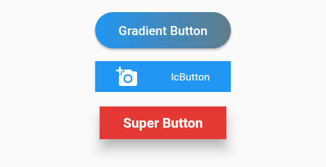

# super_ui
[](https://https://pub.dev/packages/super_ui)

A flutter package containing a range of different widgets.

## Getting Started

1) add this to your pubspec.yaml file:
```yaml
dependencies:
  super_ui: ^0.0.8+4
```
2) Run this command:
```
$ flutter pub get
```
3) Import:
```dart
import 'package:auth_buttons/super_ui.dart';
```

# Some of the widgets

## Images

1. CircularImageHolder : Circular widget for fetching both network image and file image.


```dart
CircularImageHolder(
  imageSize: 0.5,
  imageUrl: 'https://i.gadgets360cdn.com/large/google_io_afp_1583296131115.jpg',
  icon: Icons.add,
  iconBackgroundColor: Colors.pink,
),
```

## Buttons

1. GradientButton : Button with gradient effect.
2. IcButton : Button with icon.
3. SuperButton : Supports almost all important property that a fancy button should have.
4. AuthButton : Buttons with logo of social media like fb, twitter etc.




```dart
AuthButton(
  item: SocialItem.microsoft,
  onPressed: () {},
),
```


## Others

1. BillboardText : A widget to show highlighed text (Normal, Error, Warning).
2. Bubble
3. GlowingStars
4. EmptyWidget : To show whitespace
5. SuperRichText : A two parted Text widget to show two different style.


** TextFields **

1. EditText : Simple TextFormField, but easier to use.
